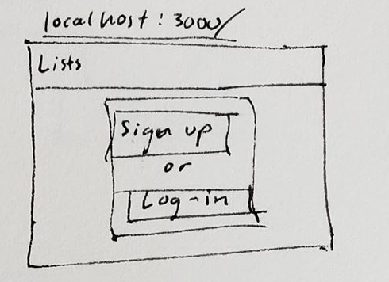
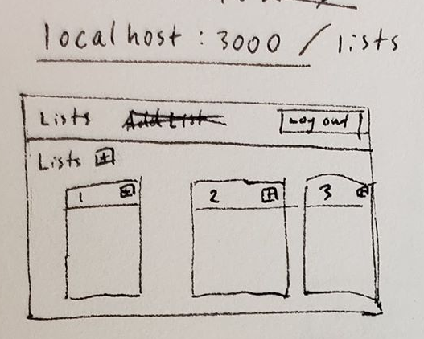
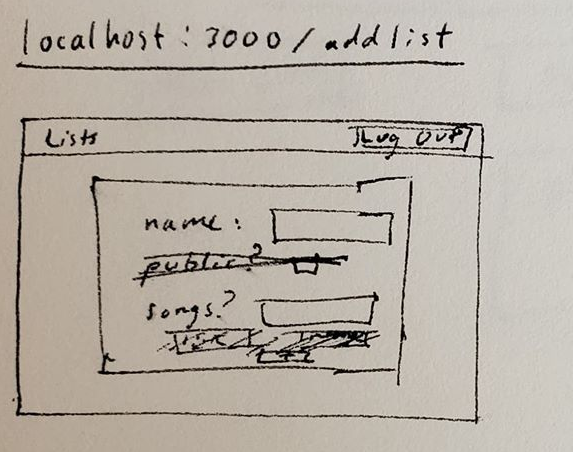
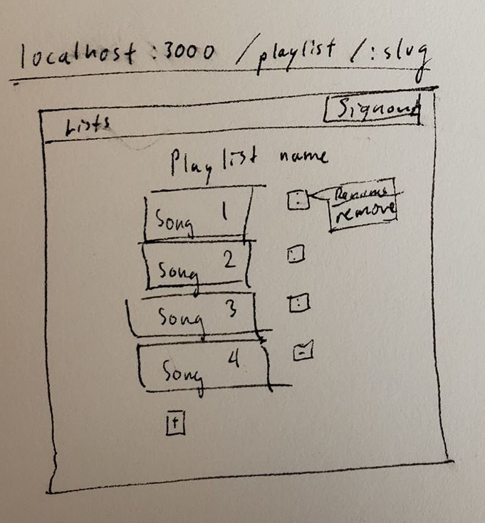
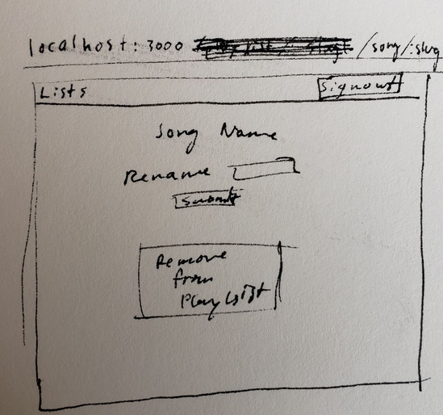

# Playlist Modeler

## Overview
Though originally meant to compile links from spotify and youtube into one location, I decided it made more sense to just choose one. At the moment, this app provides a more clear visual representation of a playlist. Users will be able to create playlists by pasting in links. In the future, the plan is to make the playlists transferable to the main Youtube site. 

## Data Model
This application stores User, Playlist and Song. 
	* Each playlist has an owner that is a user, linked by ID
	* Each song has a parent that is the ID of a playlist


An Example User

```javascript
{
  username: "TheBigBoss",
  password: // handled by passportJS
}
```

An Example Playlist
```javascript
{
  name: "My first Playlist",
  owner: String,
}
```

An Example Song
```javascript
{
  link: "youtube.com/some-song-link"
  name: "Some Song",
  parent: String, 
}
```

## [Link to Commented First Draft Schema](src/db.js) 

## Wireframes
/ - Acts as the login page. Should be redirected to lists if you are logged in 



/lists - main page where user can see created lists or create new lists



/addList - page where users can add lists 



/playlist/:slug - page with all the playlist info, incuding the actual playlist



/song/:slug - page with details on added song and song options 



## Site map


## User Stories or Use Cases
1. as non-registered user, I can login or sign up
2. as a user, I can log out
3. as a user, I can create/remove a playlist
4. as a user, I can edit add/remove in a playlist
5. as a user, I can edit songs in my playlists

## Research Topics 
* (2 points) Bootstrap 
* (6 points) User Authentication with Passport
   

## [Link to Initial Main Project File](src/app.js) 

## Annotations / References Used
http://www.passportjs.org/docs/
https://getbootstrap.com/docs/4.3/getting-started/introduction/
